# Teams Media Bot - Meeting Join Sequence Diagram

This diagram shows the complete flow of how the MediaBot joins a Microsoft Teams meeting, including all the interactions between different services and components.

```mermaid
sequenceDiagram
    participant User as 👤 User
    participant Teams as 🟦 MS Teams Client
    participant BotSvc as 🤖 Azure Bot Service
    participant VM as 🖥️ VM (demobot.site)
    participant GraphComms as 📊 MS Graph Communications
    participant GraphAuth as 🔐 MS Graph Auth (AAD)
    
    Note over User, GraphAuth: Phase 1: Bot Invitation & Authentication
    
    %% Bot Registration and Authentication
    rect rgb(240, 248, 255)
        Note over VM, GraphAuth: Bot Startup & Authentication
        VM->>GraphAuth: Authenticate with ClientSecret
        Note right of GraphAuth: tenantId: 2e3f0ff7-f208-4bc4-8b31-6caecc7dc091<br/>clientId: 3028bcbb-e83a-4578-8b09-a7b3195f84af
        GraphAuth-->>VM: Access Token
        VM->>GraphComms: Initialize CommunicationsClient
        GraphComms-->>VM: Client Ready
        Note over VM: Bot Service Started<br/>HTTPS Server: 443<br/>Webhook: /api/callback
    end
    
    %% Meeting Invitation Flow
    rect rgb(255, 248, 240)
        Note over User, BotSvc: Meeting Invitation Flow
        User->>Teams: Create Meeting & Invite Bot
        Note right of User: Meeting: "Test bot"<br/>Bot: akbotdemov1
        Teams->>BotSvc: Meeting Invitation Event
        Note right of BotSvc: installationUpdate<br/>action: "add"
        BotSvc->>VM: POST /api/callback
        Note right of VM: Webhook receives:<br/>- Meeting ID<br/>- Conversation ID<br/>- Service URL
        VM-->>BotSvc: 200 OK
        VM->>VM: Log: BotInvitedToMeeting
    end
    
    Note over User, GraphAuth: Phase 2: Actual Meeting Join Process
    
    %% Manual Join Trigger (Current Implementation)
    rect rgb(248, 255, 248)
        Note over User, VM: Manual Join Trigger (Testing)
        User->>VM: POST /api/callback/join
        Note right of User: curl -X POST<br/>{"MeetingUrl": "teams.microsoft.com/meet/..."}
        VM->>VM: Generate Call ID
        VM->>VM: Log: JoinMeetingRequested
    end
    
    %% Graph Communications Join Process
    rect rgb(255, 240, 255)
        Note over VM, GraphComms: Microsoft Graph Communications Join
        VM->>VM: Log: GraphSDKJoinAttempt
        VM->>GraphAuth: Request Fresh Token
        GraphAuth-->>VM: Bearer Token
        
        VM->>GraphComms: CreateCall Request
        Note right of GraphComms: JoinMeetingParameters:<br/>- MeetingURL<br/>- MediaConfig<br/>- CallbackURI
        
        alt Success Path
            GraphComms->>Teams: Join Meeting Request
            Teams-->>GraphComms: Call Created
            Note right of Teams: Bot appears in meeting<br/>as participant
            GraphComms-->>VM: Call Object + CallId
            VM->>VM: Log: JoinMeetingSuccess
            
            loop Call Events
                GraphComms->>VM: POST /api/callback/notifications
                Note right of VM: Call state changes:<br/>- Establishing<br/>- Established<br/>- Audio/Video events
                VM->>VM: Log: CallStateChanged
                VM-->>GraphComms: 200 OK
            end
            
        else Error Path
            GraphComms-->>VM: Error Response
            VM->>VM: Log: JoinMeetingFailed
        end
    end
    
    %% Automatic Join Flow (To Be Implemented)
    rect rgb(240, 255, 240)
        Note over Teams, GraphComms: Future: Automatic Join on Invitation
        Note over User, GraphAuth: When implemented, the invitation<br/>will trigger automatic join
        Teams->>VM: Meeting Invitation
        VM->>VM: Extract Meeting URL from invitation
        VM->>GraphComms: Auto-join meeting
        Note right of VM: Connect invitation flow<br/>to join flow
    end
    
    Note over User, GraphAuth: Phase 3: Media & Transcription (Future)
    
    rect rgb(255, 255, 240)
        Note over GraphComms, VM: Media Streaming & Transcription
        GraphComms->>VM: Audio Stream Events
        VM->>VM: Audio Processing & Transcription
        VM->>VM: Log: TranscriptionGenerated
        Note right of VM: Real-time audio analysis<br/>and meeting transcription
    end
```

## Current Implementation Status:

### ✅ **Implemented & Working:**
- **Authentication**: Bot authenticates with Microsoft Graph using client credentials
- **Webhook Reception**: VM receives Teams callbacks on `/api/callback`
- **Manual Join Trigger**: `/api/callback/join` endpoint accepts meeting URLs
- **Graph SDK Initialization**: Communications client is ready and authenticated
- **Basic Integration**: Bot can receive and process meeting invitations

### 🔧 **Next Implementation Step:**
- **Actual Meeting Join**: Complete the `GraphComms.CreateCall()` implementation in `JoinMeetingAsync`

### 🚀 **Future Enhancements:**
- **Automatic Join**: Connect Teams invitation directly to meeting join
- **Media Processing**: Handle audio streams and generate transcriptions
- **Advanced Call Management**: Handle call state changes, reconnection, etc.

## Key Components:

| Component | Role | Current Status |
|-----------|------|---------------|
| **VM (demobot.site)** | Host bot service, handle webhooks | ✅ Working |
| **Azure Bot Service** | Teams integration, message routing | ✅ Working |
| **MS Graph Communications** | Meeting join, media handling | 🔧 Ready for implementation |
| **MS Graph Auth** | Authentication & authorization | ✅ Working |
| **Teams Client** | User interface, meeting hosting | ✅ Working |

## Security & Configuration:
- **SSL/TLS**: HTTPS with valid certificates
- **Authentication**: Client credentials flow with tenant isolation
- **Webhooks**: Secure callback URLs with proper validation
- **Permissions**: Application permissions for Teams meetings and calls